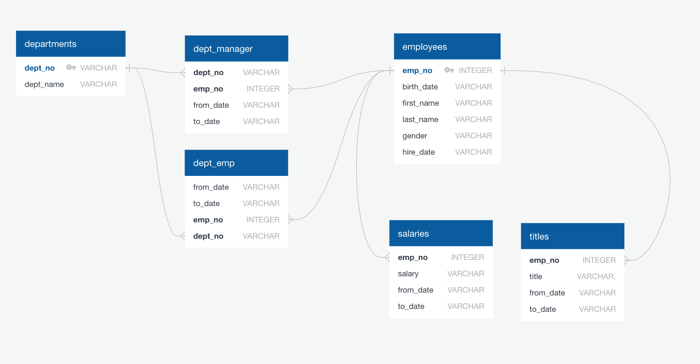

# Employer Database

This is a research project on employees of Pewlett Hackward from the 1980s and 1990s. The database contains six CVS files pertaining to the employees' information such as their salaries employee numbers, etc... The objective is to use SQL to query data and answer questions about the employees. 

### Data Modeling
An ERD of the tables was sketched out using [quickDBD](http://www.quickdatabasediagrams.com) after inspecting the CSV files. The screenshot of the diagram is shown below. 

### Data Engineering
Using the ERD as referrence, a table schema was created for each of the six CSV files. Each table specified the appropriate data types, primary keys, foreign keys, and other constraints. Once the SQL tables are defined, each CSV is imported into the corresponding table. 

### Data Analysis
All that remains is to retrieve answers from the databases, which involves selecting data with SELECT statements, and joining tables by a primary key. The following questions are answered:
1. List the following details of each employee: employee number, last name, first name, gender, and salary.

2. List employees who were hired in 1986.

3. List the manager of each department with the following information: department number, department name, the manager's employee number, last name, first name, and start and end employment dates.

4. List the department of each employee with the following information: employee number, last name, first name, and department name.

5. List all employees whose first name is "Hercules" and last names begin with "B."

6. List all employees in the Sales department, including their employee number, last name, first name, and department name.

7. List all employees in the Sales and Development departments, including their employee number, last name, first name, and department name.

8. In descending order, list the frequency count of employee last names, i.e., how many employees share each last name.

